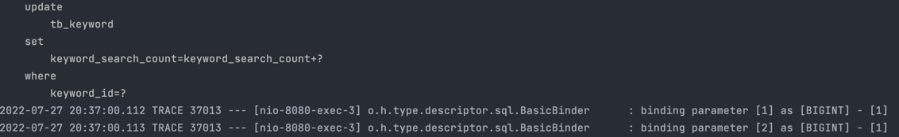
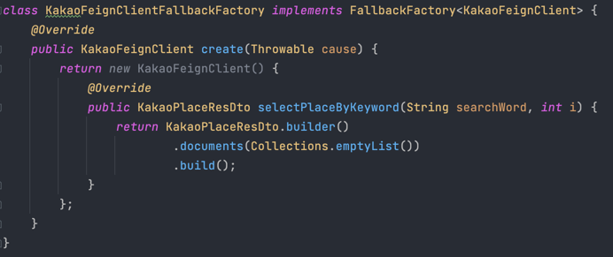
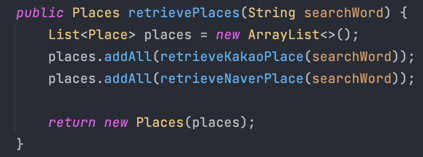
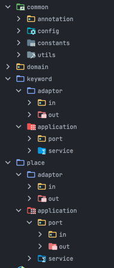
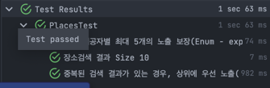

# place-search

1. 동시성 이슈가 발생할 수 있는 부분을 염두에 둔 설계 및 구현
   - 키워드 별로 검색된 횟수를 TB_KEYWORD 테이블에 저장하며 단일연산을 수행하는 update 쿼리로 count+1을 하기에 동시성 이슈 발생 가능성 제거했습니다.  
     Repeatable Read를 기본 Transaction Isolation Level로 사용하는 Mysql 같은 경우, MVCC(Multi Version Concurrecy Controll)을 통해 동시 접근을 허용하여 트랙잭션 간의 원자성을 보장합니다.
     

2. 카카오, 네이버 등 검색 API 제공자의 “다양한” 장애 발생 상황에 대한 고려
   - 검색 API에 장애가 발생하는 경우, Hystrix의 circuit breaker가 요청을 차단하고 발생한 예외를 정의한 Fallback에서 처리하여 안전하게 요청을 처리하도록 했습니다.  
    에러가 발생하지 않고 검색 결과가 없는 것처럼 반환하여 정상 로직을 수행하도록 고려했습니다.  
          

3. 구글 장소 검색 등 새로운 검색 API 제공자의 추가 시 변경 영역 최소화에 대한 고려
   - 새로운 검색 API가 추가 시 새로운 feign Client를 생성한 후 외부 인터페이스를 담당하는 PlaceSearchAdaptor에서 호출하는 메소드만 추가하는 것으로 해결할 수 있도록 고려했습니다.  
     물론 API 정의, response에 맞는 매퍼 구현 등 최소한의 수정사항은 발생합니다.
     

4. 서비스 오류 및 장애 처리 방법에 대한 고려
   - 본 프로젝트에서는 기능 요구사항을 우선으로 충족하기 위해 고려하지 못했지만, 서비스 자체가 오류가 나는 경우, hystrix circuit breaker pattern을 통해 서비스 장애에 대응할 수 있을 것 같습니다.
    
5. 대용량 트래픽 처리를 위한 반응성(Low Latency), 확장성(Scalability), 가용성(Availability)을 높이기 위한 고려    
   - 마찬가지로 본 프로젝트에서는 기능 요구사항을 우선으로 충족하기 위해 고려하지 못했지만, redis 혹은 caffeine 등을 통한 캐시를 통해 대용량 트래픽 처리를 위한 반응성, 가용성을 확보할 수 있을 것 같습니다.  
     
6. 지속적 유지 보수 및 확장에 용이한 아키텍처에 대한 설계
   - 인터페이스나 기반 요소의 변경에 영향을 받지 않는 핵심 코드를 만들기 위해 헥사고날 아키텍쳐로 알려져 있는 포트와 어댑터 아키텍쳐를 고려했습니다.  
    예를 들어 검색 제공자가 변경되거나, persistence layer에 변경이 일어나도 핵심 도메인에는 영향이 가지 않는 설계가 가능했습니다.  
     
    
7. 이 외에도 본인의 기술 역량을 잘 드러낼 수 있는 부분을 코드 내에서 강조
   - 핵심 코드를 분리할 수 있었기 때문에 중요한 도메인 오브젝트에 대한 단위테스트를 작성하기 용이했습니다.  
     좋은 단위 테스트의 조건 중 하나인 빠른 응답성을 보장하여 핵심 도메인 소스 수정에 용이했습니다. 또한 내부 구현에 의존하지 않아 리펙토링 내성 또한 확보했습니다.
     