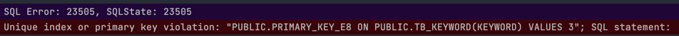
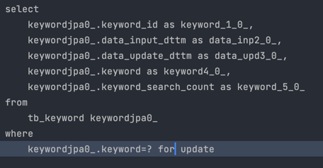

# 동시성 이슈 발생

### 개요
- KeywordPersistenceAdaptor 의 saveKeyword 메소드에서 해당 키워드가 있으면 검색횟수를 1 증가시키고,
  없는 경우 키워드를 새롭게 저장함
- 그런데 동시에 같은 검색어가 입력되는 경우, 같은 키워드가 여러번 저장되며 검색횟수+1이 아닌 insert 로직이 여러번 수행
- PK 중복 에러 발생  
  

### 접근1 - @Lock(PESSIMISTIC_WRITE) 을 통해 exclusive lock을 얻는 경우
- exclusive lock(베타 락)을 통해 row 잠금을 하여 해결할 수 있을거라 생각했는데 실패
- 이유는 여러 쓰레드가 한 번에 메소드를 호출하는 경우 키워드가 검색되지 않기 때문에 lock을 얻을 row가 없어 
  for update 쿼리가 제대로 실행되지만 동일하게 팬텀 리드 발생  

- ref: https://www.baeldung.com/jpa-pessimistic-locking
  
### 접근2 - Isolation Level - SERIALIZABLE 변경
- 멀티 쓰레드 환경에서 로직이 0.1초가 걸리더라도 100명이 동시에 요청하게 되면 누군가는 10초를 기다려야 하기 때문에 최대한 사용을 지양해야 한다. 
- 성능에 손해를 감수해야 하기 때문에 고려하지 않았음

### 접근3 - Spring-retry를 통해 재시도 
- 팬텀 리드로 인해 PK duplicate 에러가 발생하는 경우, spring-retry를 통해 재시도하도록 했다.
- KeywordPersistenceAdaptor 의 saveKeyword 메소드에 @Retryable(value = SQLException.class) 설정  
  (default 최대 3회 재시도 및 시도간 1초 지연 발생)
- thread 10개를 생성하여 insert 시도 시 정상적으로 insert 성공  
    

  
### 번외
  
- '데이터 중심 어플리케이션'에서 팬텀 리드의 예로 회의실 예약 시스템을 들었는데, 해결 방법으로 예약할 수 있는 시간대 row를 미리 만들어두고,
해당 데이터에 lock을 얻는 방식을 설명하기도 했다.
- 이를 충돌을 구체화한다고 하는데 직관적이지 않은 해결책이지만 허용 가능한 성능 수준을 위해 어느 정도의 복잡성을 희생해야 한다.
